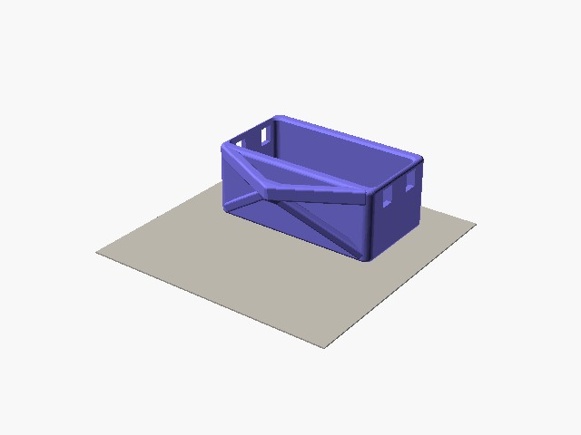
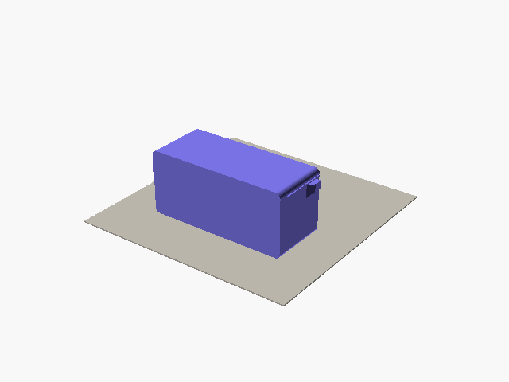
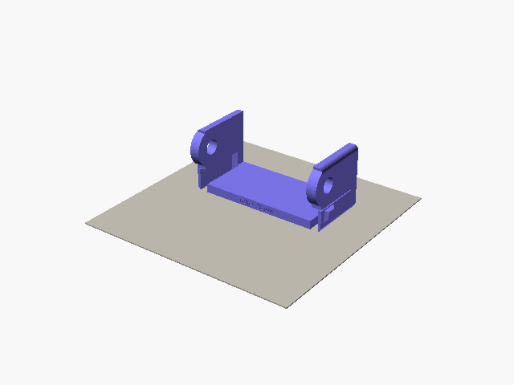
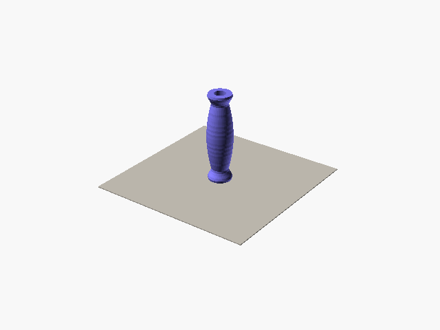
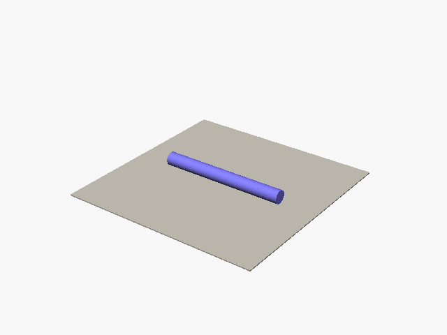
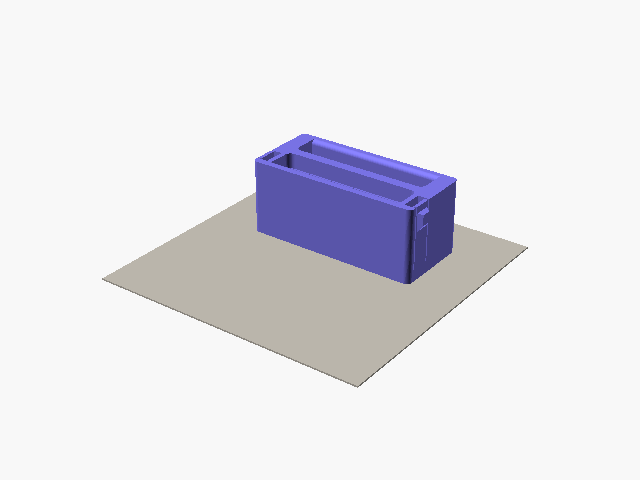

# Printing opengrips

These settings are where I'd start. They aren't load-tested yet, so read the note in the [README](README.md) first.

## Material

Print everything in PETG. PLA gets brittle in the cold and slowly bends when it's warm, say in a car on a sunny day.

## Settings

| Part | Walls | Infill |
| --- | --- | --- |
| Housing, edge, pocket and two-sided inserts, roller frame | 3 | 15% gyroid |
| Roller | 3 | 20% |
| Printed axle | 4 | 100% |

Use a 0.4 mm nozzle and 0.2 mm layers. These parts take your whole pull, so don't go below these settings to save time.

## Which way up

Each part has one right way up. It keeps the load running along the layers and the grip smooth. The files from the configurator already sit this way, so you only need to slice them.

| Part | On the bed | Supports |
| --- | --- | --- |
| Housing | On its back, pocket opening up | Automatic, under the anchor |
| Edge or pocket insert | Upside down, top face down | Only under the slot floor |
| Two-sided insert | On its back, front up | None |
| Roller frame | Upright, floor down | Under the two cheeks, where the latch arms are cut away |
| Roller | Standing on one end | None |
| Printed axle | Lying down | None |

| Housing | Edge insert | Pocket insert |
| --- | --- | --- |
|  |  |  |

| Roller frame | Roller | Axle |
| --- | --- | --- |
|  |  |  |

| Two-sided insert |
| --- |
|  |

If you render a part yourself, add `-D for_print=true` to get it the right way up:

```sh
openscad -D 'part="housing"' -D for_print=true -o housing.stl opengrips.scad
```

## How much filament

I sliced the default parts in PrusaSlicer 2.9.6 with the settings above, PETG at 1.27 g/cm³, and no supports. Nothing has been weighed after a real print yet.

| Part | Filament |
| --- | --- |
| Housing, pyramid anchor | 93 g |
| Housing, keel anchor | 90 g |
| Edge insert, 20 mm | 87 g |
| Pocket insert, three-finger | 88 g |
| Two-sided insert, 20 and 10 mm edges | 87 g |
| Roller frame | 41 g |
| Roller, unlevel | 25 g |
| Roller, straight | 30 g |
| Printed axle | 17 g |

Automatic supports add about 18 g to the pyramid housing and about 6 g to the roller frame. A housing and one edge insert come to about 180 g, so a 1 kg spool gets you a housing and about ten inserts.

## The fit test

On a new printer, print the fit test before the kit. In the configurator, click "fit test" under Download. You get one zip with four small parts, already the right way up. Use the housing settings above.

- The ring is a thin slice of the housing pocket, and the frame is a thin slice of an insert. Push the frame into the ring. It must slide in without force.
- The latch channel is a short piece of housing wall with the real window, and the latch cheek is one side of an insert with the real latch arm. Slide the cheek into the channel until the button clicks into the window. Then press the button in and pull the cheek out by its tab.

If a pair sticks, follow step 3 below, then print the fit test again.

## Checking the fit

1. Slide the insert into the housing. Both side buttons should click into their windows.
2. Pinch both buttons and pull the insert out by the grip. It should come out without a fight.
3. If it sticks, look at the face that was on the bed. A flared first layer, the "elephant's foot", is the usual cause. Trim or sand that edge, or turn on elephant-foot compensation in your slicer.

## Before your first session

- Pull out all the supports, and make sure none are left in the slot or the latch windows.
- Look for split layers at the anchor, around the latch arms and at the grip. Don't use a cracked part.
- Hang the block from the carabiner and load it slowly by hand before you pull hard.
