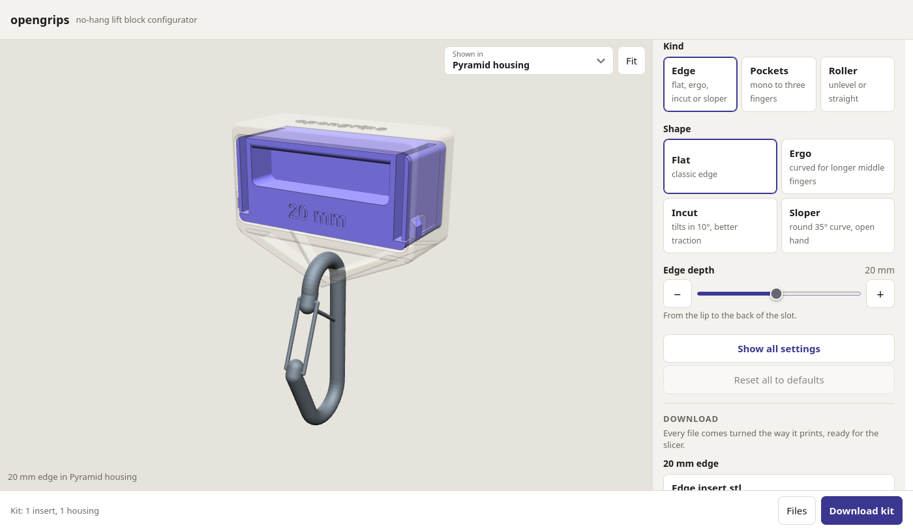
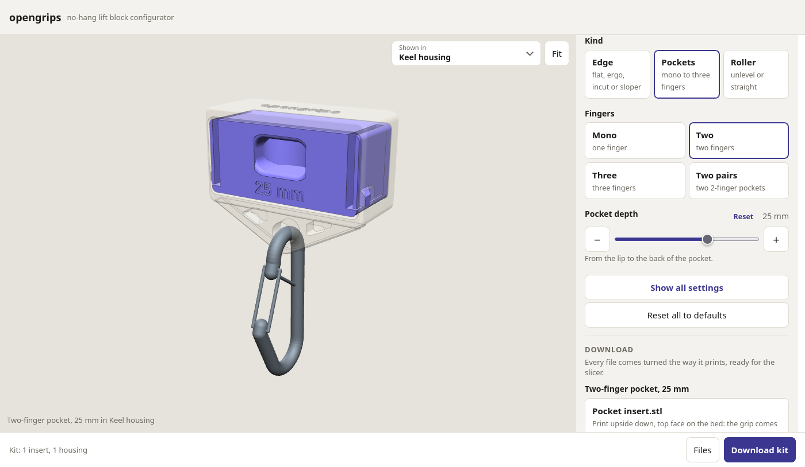

<div align="center">
  
  <h1>opengrips</h1>
  <p>A no-hang lift block you can print yourself, with grips you swap by hand.</p>
  <p>
    <a href="https://awalvie.github.io/opengrips/">Configurator</a> ·
    <a href="PRINTING.md">Printing guide</a> ·
    <a href="TODO.md">To do</a> ·
    <a href="https://github.com/awalvie/opengrips/issues">Issues</a>
  </p>
</div>

opengrips is a lift block for finger training. One housing hangs off a carabiner, and the grips slide into it and click in place: edges, pockets and rollers.

You can build your own at [awalvie.github.io/opengrips](https://awalvie.github.io/opengrips/). Pick your grips, change the depth and the shape, and download the files. It all runs in your browser, and the page link keeps your kit, so you can bookmark it or share it.



This is a prototype, and I haven't load-tested it yet. Print and use it at your own risk, check it before every session, and stop using any part that cracks.

## What you can make

- Edges from 6 to 35 mm deep: flat, ergo, incut up to 20°, or slopers down to 45°.
- Pockets: mono, two-finger, three-finger, or up to three side by side.
- Rollers: unlevel or straight.
- Two anchors under the housing: a pyramid of four bars, or a keel plate with a hole.

Every anchor holds the carabiner right under the grip, so the edge should stay level when you pull. I haven't measured that yet.



## Printing

Print everything in PETG. The housing goes on its back and the inserts go upside down, and the files you download already sit that way. A housing and one edge insert take about 265 g of filament.

The [printing guide](PRINTING.md) has the settings, where the supports go, and how to check the fit.

## You'll also need

- A steel screwgate carabiner, and a loading pin or sling for the weights.
- For the roller, a 12 mm steel rod or dowel as the axle, or you can print one.

## Putting it together

1. For the roller, drop it between the cheeks and push the axle through.
2. Slide the insert into the housing until both side buttons click.
3. To swap it, pinch both buttons and pull the insert out by the grip.
4. Clip the carabiner to the anchor under the housing.

## Working on it

The model is plain OpenSCAD, in `opengrips.scad` and `src/`. You can set any parameter from the command line:

```sh
openscad -D 'part="insert_edge"' -D slot_d=15 -o edge.stl opengrips.scad
```

To run the configurator locally, start `python3 web/server.py` and open http://localhost:8000. `web/catalog.py` lists what it offers.

`python3 tools/check_parts.py` renders every preset and the extremes of each setting, and checks that the parts still hold together. It needs OpenSCAD and Python with trimesh, or run `nix develop` to get both.

If you find a problem or print one, [open an issue](https://github.com/awalvie/opengrips/issues).

## License

The design is under [CERN-OHL-S-2.0](LICENSE). The configurator runs a copy of [OpenSCAD](https://openscad.org/) in the browser, which is GPL-2.0; see `web/static/vendor/openscad/`.
